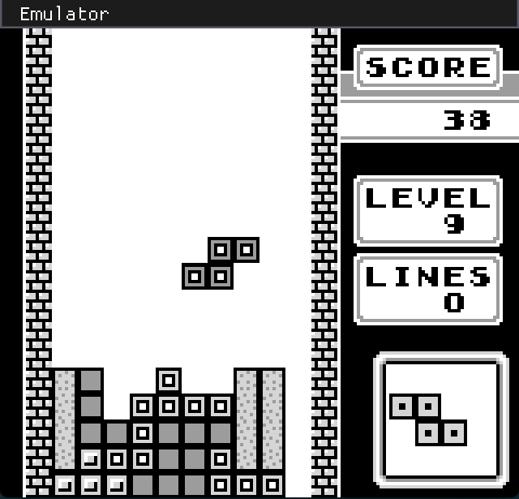
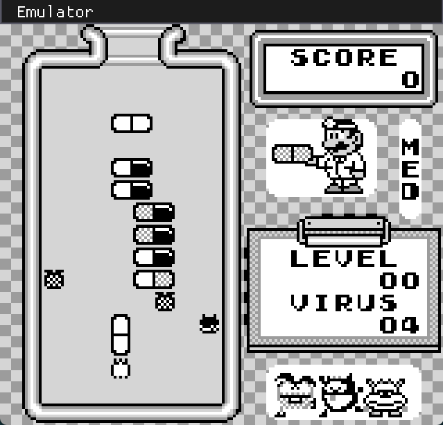
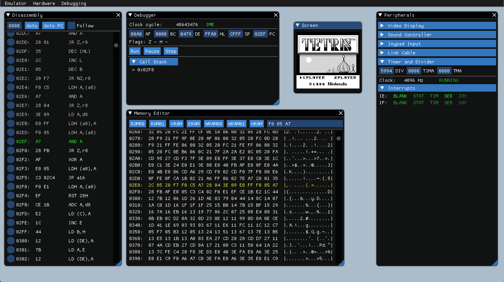

# gib

[](https://circleci.com/gh/plorefice/gib)
[](LICENSE)

Low-level, cycle-accurat original Gameboy (DMG) emulator written in Rust, also featuring several tools
for ROM debugging and development.

It is still a WIP, but some simple ROMs have been tested and are (mostly) playable:

* **Tetris** (JP) (Nintendo)
* **Dr. Mario** (JP) (Nintendo)
* **The Legend of Zelda: Link's Awakening** (US) (Nintendo)

## Screenshots

### In-game

| Tetris                                                      | Dr. Mario                                                     | Link's Awakening                                           |
| ----------------------------------------------------------- | ------------------------------------------------------------- | ---------------------------------------------------------- |
|  |  |  |

### Development UI



## Building the project

After installing Rust (you can use [rustup](https://rustup.rs) for that), run:

```shell
git clone git@github.com:plorefice/gib
cd gib/
cargo build --release
```

## Running the emulator

Once you have a ROM file, you can use:

```shell
cargo run --release [-- [--devel] [rom-file]]
```

The `--devel` flags will open the emulator in development/debugging mode, which includes
disassembly view, memory viewer, step-by-step debugger and peripheral status overview.

The optional `[rom-file]` argument can be used to load a ROM directly from the command line.
Alternatively, you can use the in-app menus; this is currently supported only in development mode.

## Using the emulator

The joypad is mapped to the keyboard according to this table:

| Joypad | Keyboard  |
| ------ | --------- |
| Up     | Up        |
| Down   | Down      |
| Left   | Left      |
| Right  | Right     |
| B      | Z         |
| A      | X         |
| Select | Backspace |
| Start  | Return    |
| Turbo  | Space     |

## Running tests

Currently, unit tests exist for opcode size and timings, along with some peripherals.
In the future, more complete tests will be developed. Some golden tests are also
included to test against known working test ROMs (eg. blargg's).

You can run the test suite with:

```shell
cargo test --release
```

## Features

The emulator is still a long way from being complete. The current status and roadmap
are shown below.

### Progress

| Peripheral | Progress | Notes                                     |
| ---------- | -------- | ----------------------------------------- |
| CPU        | 100%     | Timings verification still missing        |
| Video      | 80%      | BG, Sprite, Window and IRQ support        |
| Sound      | 65%      | Channels #1, #2 and #3 are mostly working |
| Joypad     | 80%      | IRQ support missing                       |
| Link cable | 0%       | Not implemented yet                       |
| Timers     | 100%     | Passes all Gekkio's acceptance tests      |
| Interrupts | 90%      | Need to work on time accuracy             |
| MBC        | 20%      | Support for some functions of MBC1        |

### Blargg's Test ROMs

[Blargg's Gameboy hardware test ROMs](https://github.com/retrio/gb-test-roms) results.

The passing tests are also integrated in the emulator's test suite.

| Test ROM       | Progress | Notes                |
| -------------- | -------- | -------------------- |
| cpu_instrs     | 100%     | Full pass!           |
| instr_timing   | 100%     | Full pass!           |
| interrupt_time | -        | Requires CGB support |
| mem_timing-2   | 100%     | Full pass!           |
| mem_timing     | 100%     | Full pass!           |
| halt_bug       | -        | Not tested yet       |
| oam_bug        | -        | Not tested yet       |
| dmg_sound      | -        | Not tested yet       |

### Gekkio's test suite

[Gekkio's mooneye-gb test ROMs](https://gekkio.fi/files/mooneye-gb/latest/) results.

The passing tests are also integrated in the emulator's test suite.

| Test Suite             | Progress | Notes                               |
| ---------------------- | -------- | ----------------------------------- |
| acceptance/bits/       | 100%     | Full pass!                          |
| acceptance/instr/      | 100%     | Full pass!                          |
| acceptance/interrupts/ | 0%       | Not yet                             |
| acceptance/oam_dma/    | 100%     | Full pass!                          |
| acceptance/ppu/        | -        | Not tested yet                      |
| acceptance/serial/     | -        | Not tested yet                      |
| acceptance/timer/      | 100%     | Full pass!                          |
| acceptance/boot_*      | 100%     | All default boot values are correct |

## Resources

* [GBDev Wiki](http://gbdev.gg8.se/wiki/articles/Main_Page)
* [The PanDocs](http://bgb.bircd.org/pandocs.htm)
* [Pastraiser's Gameboy CPU (LR35902) instruction set](http://www.pastraiser.com/cpu/gameboy/gameboy_opcodes.html)
* [GameBoy Opcode Summary](http://www.devrs.com/gb/files/opcodes.html)
* [gbz80](https://rednex.github.io/rgbds/gbz80.7.html)
* [Gekkio's mooneye-gb test ROM sources](https://github.com/Gekkio/mooneye-gb/tree/master/tests)

... and any other brave soul posting any kind of GB info on the Internet :pray:
